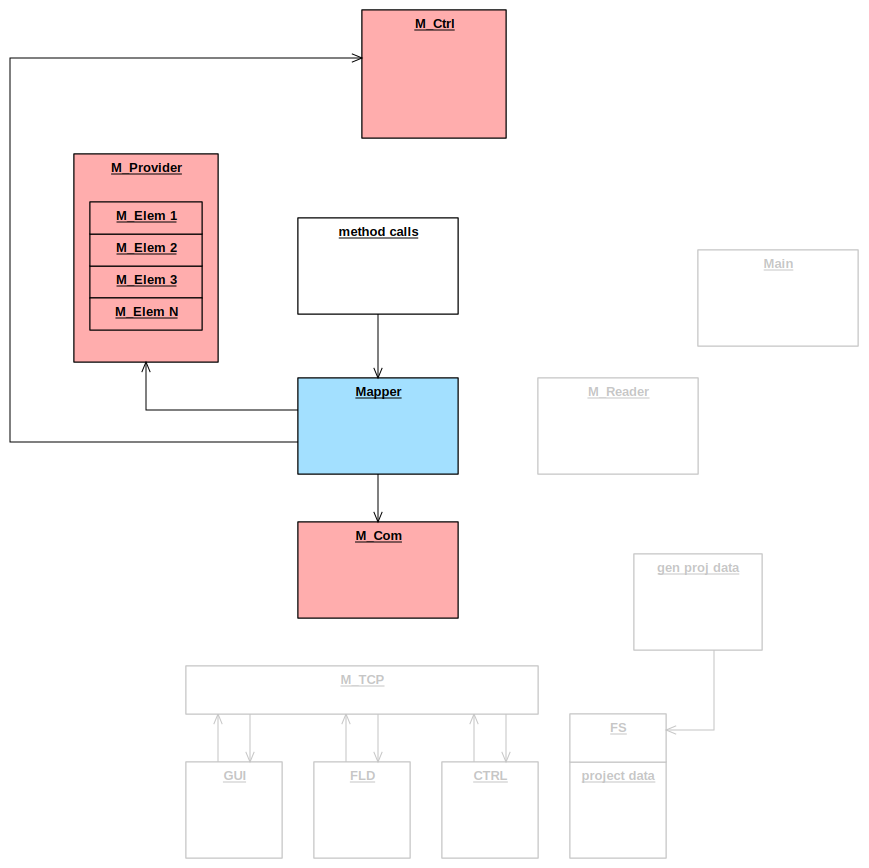
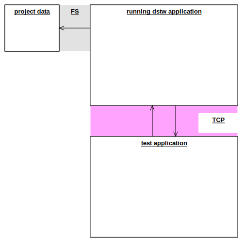

# testing

## CppUTest
CppUTest is the base of testing in this project for good reasons:

-   it's lean and fast
-   it runs on almost every device and platform. I have used (and customized) it with:
    - CAD-UL
    - IAR
    - VS
    - gcc
    - eclipse / Mingw
-   the greatest advantage to other frameworks: it natively handles unexpected calls as well as expected calls that aren't fulfilled

## module tests
### Interface Locator (IL)
The Interface Locator is a light weight version of the service locator pattern.

In test context every module instance that realizes an interface is substituted by a mock.

The software compiled for production does not provide any substitution of the modules in charge.

The whole thing is achieved by different include paths leading to two different IL.h headers.

This concept has been SIL4 validated already.

### module test principle
If testing a single application module (SUT, software under test)
-   we describe expected calls to other modules,
-   trigger the SUT by method calls
-   and check if the mocked modules were called as expected.

### sample: test of Mapper
#### mocks and calls scheme

## system tests
Here we have
-   a DSTW application built without any test code
-   a test application

The system tests take place that way:
- At startup the DSTW application reads project data provided for testing
- The test application then communicates via TCP

## code coverage
- [coverage tools](coverage_tools.md)
- [current bullseye coverage](coverage_bullseye.md)

## used APIs
- [CppUTestSteps](https://github.com/sorgom/CppUTestSteps)

## IL headers
- [header for production build](../application/components/SYS/IL.h)
- [header for test build](../testing/testenv/SYS/IL.h)
